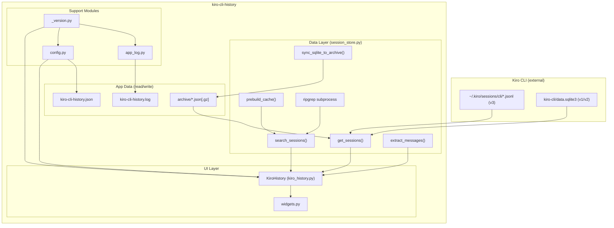
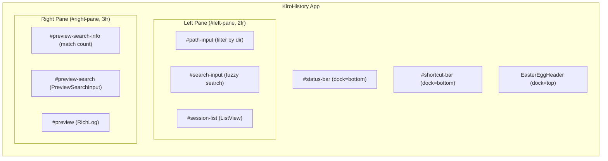
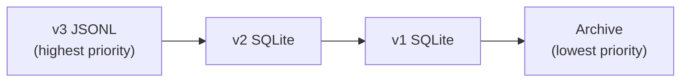
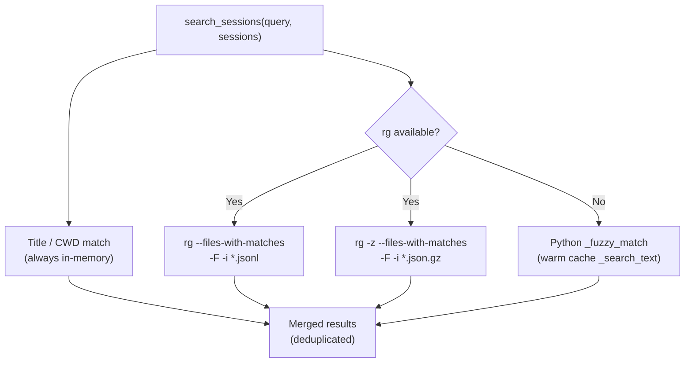
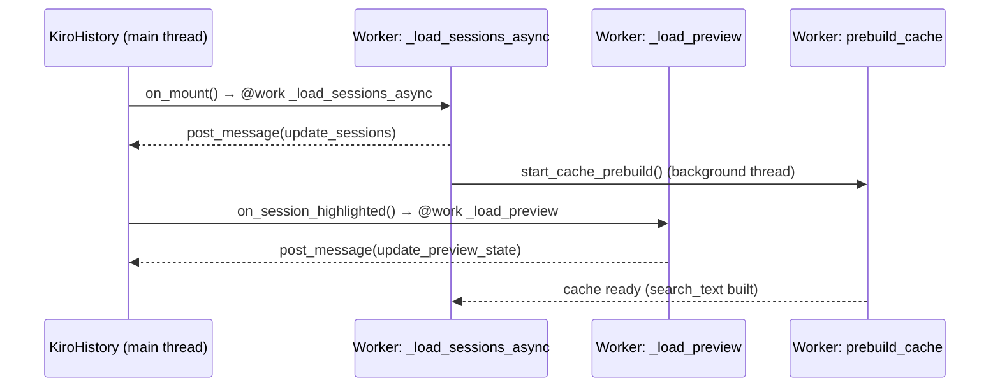

# Architecture

## Overview

kiro-cli-history follows a strict two-layer architecture: a pure data/search layer (`session_store.py`) and a UI layer (`kiro_history.py` + `widgets.py`). The data layer has no Textual imports and is safe to use in tests and CLI tools independently.

## High-Level Architecture

## Layer Responsibilities

### Data Layer (`session_store.py`)
- Reads session data from all three Kiro CLI storage formats
- Performs fuzzy search with optional ripgrep acceleration
- Manages the archive (SQLite-to-JSON backup system)
- Exposes a clean public API — no Textual dependencies
- Thread-safe: cache prebuild runs in a background thread

### UI Layer (`kiro_history.py`, `widgets.py`)
- `KiroHistory` is a Textual `App` subclass orchestrating the full UI
- Delegates all data access to `session_store`
- Uses Textual workers (`@work`) for non-blocking background operations
- Inline CSS defines the two-pane layout

### Support Layer
- `config.py` — atomic JSON config read/write with schema versioning
- `app_log.py` — optional debug log with rotation/compression
- `_version.py` — single source of truth for version string, injected at install time

## UI Layout

## Session Source Priority

When the same session exists in multiple stores, the deduplication priority is:

## Search Architecture

## Concurrency Model

## Key Design Decisions

- **No circular imports**: `session_store`, `config`, `app_log`, `_version` have no cross-dependencies except `_version` being imported by all three support modules.
- **Graceful degradation**: `config` and `app_log` imports in `kiro_history.py` are wrapped in try/except; app runs without them.
- **Read-only by default**: SQLite opened with `?mode=ro` URI flag; JSONL files read-only. Writes only to app-owned data (archive, config, log).
- **Atomic writes**: Config and archive files use tempfile + `os.replace()` to prevent corruption.
- **Test isolation**: `KIRO_DEMO_DIR` env var redirects all data paths to a temp directory, making tests fully isolated without mocking.
