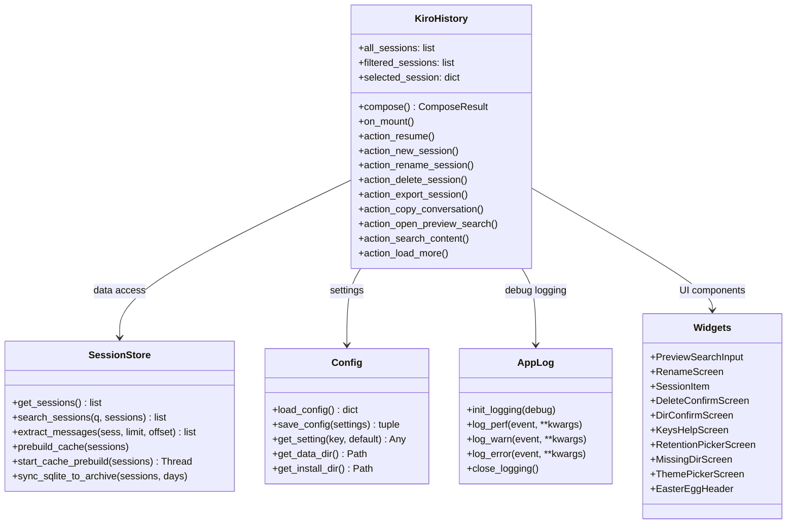

# Components

## Component Map

---

## kiro_history.py — `KiroHistory`

The central Textual `App` class. Owns the full application lifecycle.

**Responsibilities**:
- Composes the two-pane layout (session list + preview)
- Dispatches background workers for session loading, search, and preview rendering
- Handles all keyboard bindings and user actions
- Manages lazy loading state (`_preview_messages`, `_preview_all_loaded`, `PREVIEW_BATCH_SIZE=30`)
- Manages in-preview search state (`_preview_search_matches`, `_preview_search_current`)
- Persists settings via `config.py` on app close

**Key state attributes**:

| Attribute | Type | Purpose |
|-----------|------|---------|
| `all_sessions` | `list[dict]` | All sessions loaded from all stores |
| `filtered_sessions` | `list[dict]` | Sessions after path + search filter |
| `selected_session` | `dict \| None` | Currently highlighted session |
| `_preview_messages` | `list[dict]` | Messages loaded for current preview |
| `_preview_all_loaded` | `bool` | Whether all messages are in memory |
| `_preview_search_matches` | `list[int]` | Indices of search matches in `_preview_messages` |
| `_preview_search_current` | `int` | Active match index (-1 = none) |
| `_search_id` | `int` | Debounce counter; stale search workers check this |
| `_sessions_loading` | `bool` | True while background session load is in progress |

**Important methods**:
- `_load_sessions_async()` — Textual worker; loads all sessions in background, starts cache prebuild
- `_load_preview()` — worker; extracts first `PREVIEW_BATCH_SIZE` messages and renders to RichLog
- `_load_more_messages()` — worker; fetches next batch (offset-based) on `Ctrl+M`
- `_do_search()` — debounced search; increments `_search_id` to cancel stale results
- `_run_preview_search()` — runs in-preview search; finds message indices matching query
- `action_resume()` — spawns `kiro chat --resume <session_id>` via subprocess
- `sync_sqlite_to_archive()` — called on mount to backup SQLite sessions to archive

---

## session_store.py

Pure data/search layer. No Textual imports. Thread-safe.

**Session loading**:

| Function | Source | Notes |
|----------|--------|-------|
| `_load_jsonl_sessions()` | `~/.kiro/sessions/cli/` | Reads `.json` metadata + `.jsonl` history |
| `_load_sqlite_sessions()` | SQLite DB | Reads v1 (`conversations`) and v2 (`conversations_v2`) |
| `_load_archive_sessions()` | `<data_dir>/archive/` | Reads `.json` and `.json.gz` |
| `get_sessions()` | All sources | Merges, deduplicates (JSONL > SQLite > Archive), sorts by recency |

**Search**:

| Function | Mechanism |
|----------|-----------|
| `search_sessions()` | Top-level dispatcher |
| `_rg_find_in_dir()` | ripgrep subprocess for JSONL dir and archive |
| `_fuzzy_match()` | Python in-memory match on `_search_text` (warm cache) |
| `_build_search_text()` | Builds searchable text from session metadata + first prompt |
| `prebuild_cache()` | Fills `_search_text` for all JSONL sessions (blocking) |
| `start_cache_prebuild()` | Runs `prebuild_cache()` in a daemon thread |

**Message extraction**:
- `extract_messages(session, limit, offset)` — dispatches to JSONL/SQLite/archive reader
- `_extract_messages_from_history(history, limit, offset)` — parses the raw history entries

**Archive management**:
- `sync_sqlite_to_archive(sessions, retention_days)` — exports new SQLite sessions to archive; compresses old `.json` → `.json.gz`

---

## widgets.py

Self-contained Textual components. No dependency on `kiro_history.py`.

| Widget | Type | Purpose |
|--------|------|---------|
| `SessionItem` | `ListItem` | Single row in session list — shows title, CWD, date |
| `PreviewSearchInput` | `Input` | In-preview search bar; Shift+Tab emits `PrevMatchRequested` |
| `EasterEggHeader` | `Header` | Collapses subtitle on click |
| `RenameScreen` | `ModalScreen` | Dialog for renaming a session (F2) |
| `DeleteConfirmScreen` | `ModalScreen` | Confirm/cancel session deletion |
| `DirConfirmScreen` | `ModalScreen` | Confirm resume in a different directory |
| `MissingDirScreen` | `ModalScreen` | Shown when session's original directory is missing |
| `KeysHelpScreen` | `ModalScreen` | Full keyboard shortcuts reference |
| `RetentionPickerScreen` | `ModalScreen` | Pick archive retention days |
| `ThemePickerScreen` | `ModalScreen` | Pick Textual theme |

---

## config.py

Settings persistence.

**Schema**: JSON file at `<data_dir>/kiro-cli-history.json`

**Default settings**:

| Key | Type | Default |
|-----|------|---------|
| `trust_all_tools` | bool | `true` |
| `show_single_turn` | bool | `false` |
| `show_untitled` | bool | `false` |
| `theme` | str | `"textual-dark"` |
| `debug` | bool | `false` |
| `retention_days` | int | `90` |

**Key behaviors**:
- Missing config file → returns defaults (no error)
- Corrupt JSON → silently falls back to defaults
- Unknown keys → filtered out on save (schema hygiene)
- Bool settings type-enforced (rejects `"yes"`, `1` etc.)
- Writes are atomic via tempfile + `os.replace()`

---

## app_log.py

Optional debug logging module.

**Log levels** (written only when enabled):
- `PERF` — performance measurements (startup time, search time)
- `WARN` — abnormal but recoverable conditions
- `ERROR` — always written, even when debug is disabled

**Rotation**: 2 MB → compressed `.gz`, max 10 rotated files, 60-day retention

**Thread safety**: uses `threading.Lock()` around all writes

---

## _version.py

Single source of truth for version string.

- `VERSION` — fallback constant (e.g. `"v0.1.0-cakel.9"`)
- `_BUILT_VERSION` / `_BUILT_HASH` — injected by install scripts at install time from `git describe`/`git rev-parse`

Imported by `kiro_history.py`, `config.py`, and `app_log.py` to avoid circular imports.

---

## Test Components

### tests/fixtures/
- `_Spec` — dataclass describing a fixture set (dirs, session counts, expected search results)
- `build_fixture_dir(spec)` — creates a JSONL+SQLite fixture directory matching spec
- `build_integration_fixtures()` — builds larger fixtures for integration tests

### tests/conftest.py
- `fixture_dir` — pytest fixture providing isolated temp dir with synthetic sessions
- `fx_sessions` / `fx_warm` — pre-loaded session list fixtures

### tests/helpers.py
- `result_ids(sessions)` — extracts session IDs from search results
- `reset_cache()` — clears module-level search cache between tests
