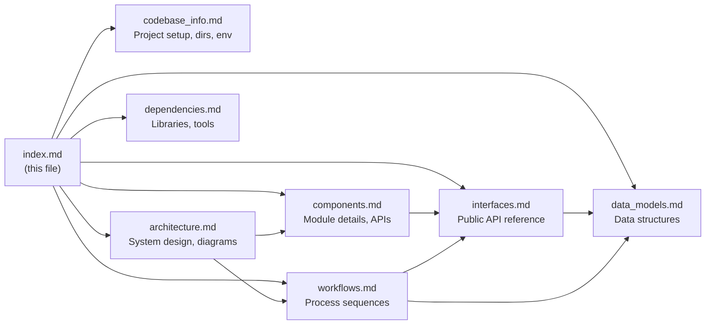

# Documentation Index

> **For AI assistants**: Start here. This file contains enough metadata about each document that you can determine which file(s) to consult without reading them all. Load only the specific files relevant to the question at hand.

## Project at a Glance

**kiro-cli-history** is a Python 3.10+ terminal UI (using the Textual framework) that provides global fuzzy-search, browsing, and resuming of Kiro CLI conversation sessions across all directories. It reads three Kiro CLI session storage formats (JSONL v3, SQLite v2, SQLite v1) and adds an archive tier for long-term persistence.

**Entry point**: `kiro_history.py` → `main()` → `KiroHistory(App)`

**Core modules** (flat structure, no packages):
- `kiro_history.py` — Textual app, UI controller
- `session_store.py` — data/search layer (no UI imports)
- `widgets.py` — reusable Textual widgets
- `config.py` — settings persistence
- `app_log.py` — debug logging
- `_version.py` — version string

---

## Document Map

### For code navigation questions
→ **[components.md](components.md)**: Detailed breakdown of every module and class — responsibilities, key methods, state attributes, and internal logic patterns.

### For architecture and design questions
→ **[architecture.md](architecture.md)**: Two-layer architecture (data vs UI), Mermaid diagrams for component relationships, session source priority, search architecture, concurrency model, key design decisions (no circular imports, read-only SQLite, atomic writes, test isolation via env var).

### For "how does X work" questions
→ **[workflows.md](workflows.md)**: Step-by-step sequence diagrams for: app startup, session list filtering, preview lazy loading, load-more, in-preview search, session resume, rename, archive sync, export, ESC behavior.

### For API/interface questions
→ **[interfaces.md](interfaces.md)**: Complete public API for `session_store.py` and `config.py`, all keyboard bindings, widget message types, modal screen return values, external subprocess calls (kiro CLI, ripgrep).

### For data structure questions
→ **[data_models.md](data_models.md)**: Session dict schema, message dict schema, config JSON schema, JSONL file format (metadata sidecar + history format), SQLite table schemas (v1/v2), archive file schema, log entry format.

### For dependency questions
→ **[dependencies.md](dependencies.md)**: Runtime deps (textual ≥ 0.40.0), bundled ripgrep (5 platforms), dev deps (pytest, pytest-asyncio, pytest-timeout), stdlib usage table, CI environment, external process dependencies (kiro CLI).

### For project setup and environment questions
→ **[codebase_info.md](codebase_info.md)**: Directory structure, technology stack table, runtime data locations (per OS), env vars (`KIRO_DEMO_DIR`, `KIRO_HISTORY_DATA_DIR`), test markers and how to run each tier.

---

## Quick Reference

### Where is X?

| What you're looking for | File | Key section |
|------------------------|------|-------------|
| App entry point / `main()` | `kiro_history.py` | Top-level |
| Session loading from disk | `session_store.py` | `get_sessions()` |
| Search implementation | `session_store.py` | `search_sessions()`, `_rg_find_in_dir()` |
| Preview rendering | `kiro_history.py` | `_load_preview()`, `_render_messages()` |
| Keyboard bindings | `kiro_history.py` | `BINDINGS` class var + `on_key()` |
| All modal dialogs | `widgets.py` | `*Screen` classes |
| Settings keys and defaults | `config.py` | `DEFAULT_SETTINGS` |
| Data directory path | `config.py` | `get_data_dir()` |
| ripgrep binary path | `session_store.py` | `_rg_path()` |
| Archive compression | `session_store.py` | `sync_sqlite_to_archive()` |
| Version string logic | `_version.py`, `kiro_history.py` | `_get_version_string()` |
| Log format | `app_log.py` | `_write_log()`, `_format_timestamp()` |
| Test fixtures | `tests/fixtures/__init__.py` | `build_fixture_dir()` |
| Test isolation | `tests/conftest.py` | `fixture_dir` fixture + `KIRO_DEMO_DIR` |

### Test tiers

| Tier | How to run | Speed |
|------|-----------|-------|
| Unit (default) | `pytest tests/` | Fast (~seconds) |
| Slow / headless GUI | `pytest tests/ -m slow` | 2–5s per test |
| Integration (real data) | `pytest tests/integration/` | Requires `~/.kiro` data |

### Key constants

| Constant | Value | File |
|----------|-------|------|
| `PREVIEW_BATCH_SIZE` | `30` | `kiro_history.py` |
| `MAX_FILE_SIZE` | 100 MB | `session_store.py` |
| `MAX_LOG_BYTES` | 2 MB | `app_log.py` |
| `MAX_AGE_DAYS` (log) | 60 days | `app_log.py` |
| `SCHEMA_VERSION` (config) | `1` | `config.py` |
| `CONFIG_FILENAME` | `kiro-cli-history.json` | `config.py` |

---

## Relationships Between Documents

---

## Common Question Routing

| Question type | Start with |
|--------------|-----------|
| "How do I add a new keyboard shortcut?" | interfaces.md → components.md |
| "Where does session data come from?" | architecture.md → data_models.md |
| "How does search work?" | workflows.md → interfaces.md |
| "What is the config file structure?" | data_models.md |
| "How do I write a test for new code?" | codebase_info.md → components.md (test components section) |
| "What does session_store expose?" | interfaces.md |
| "How is the archive maintained?" | workflows.md (archive sync) → data_models.md (archive schema) |
| "How does lazy loading work?" | workflows.md (preview load) → components.md (KiroHistory state) |
| "What env vars affect behavior?" | codebase_info.md |
