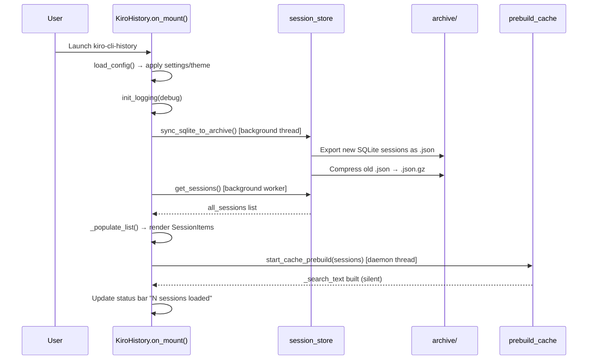
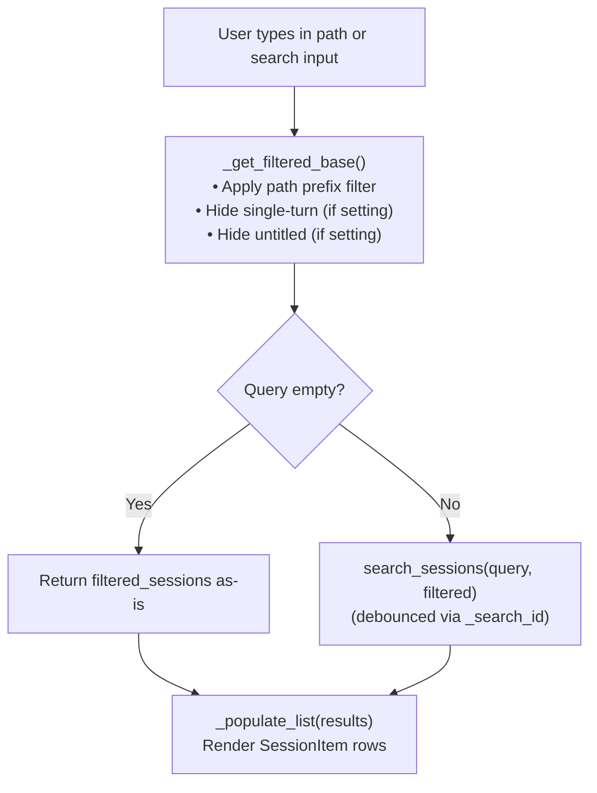
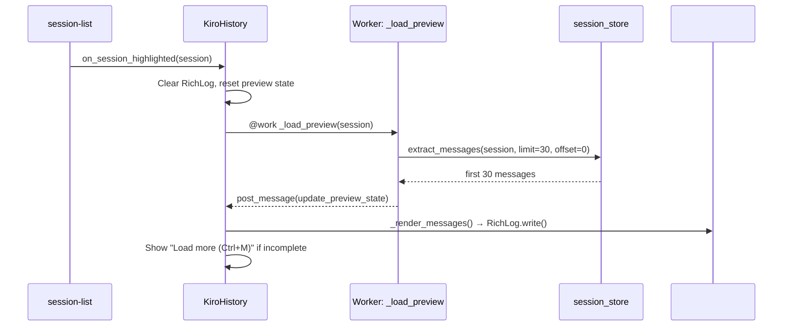
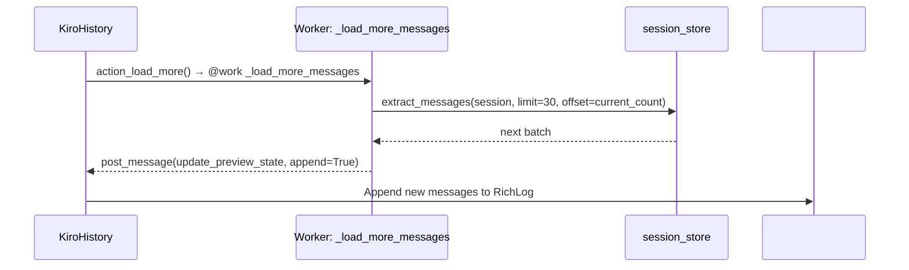
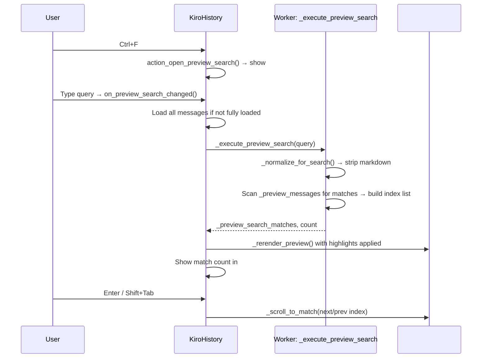
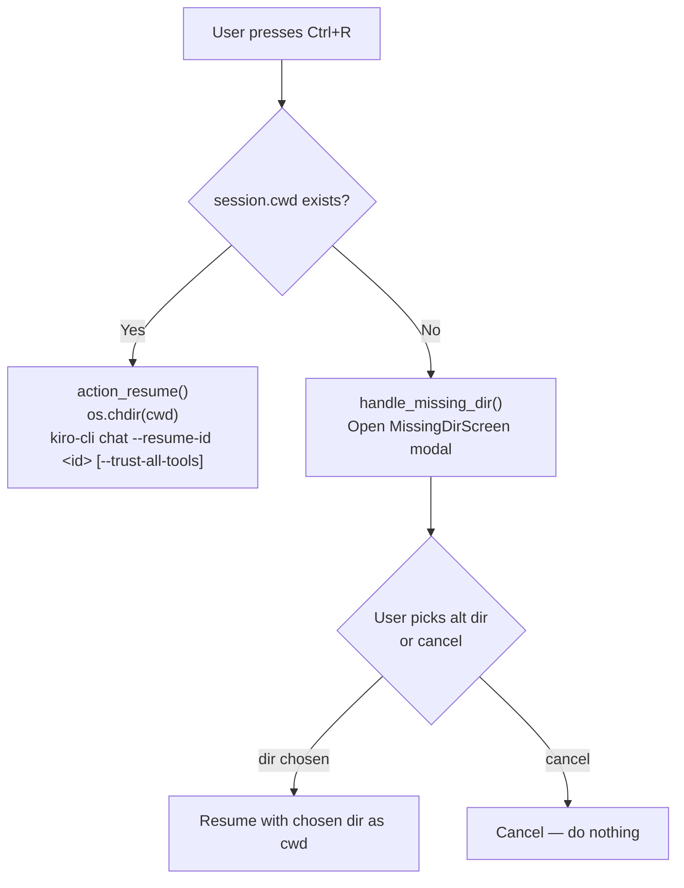
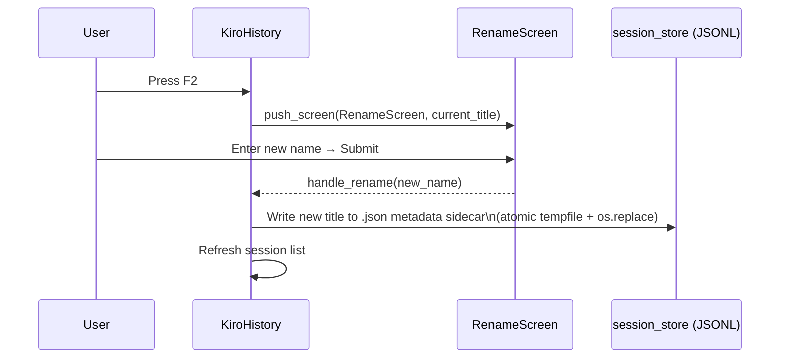
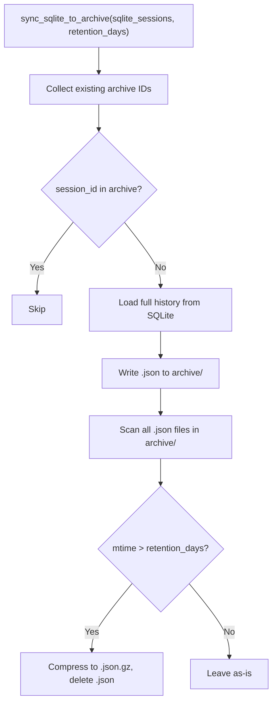
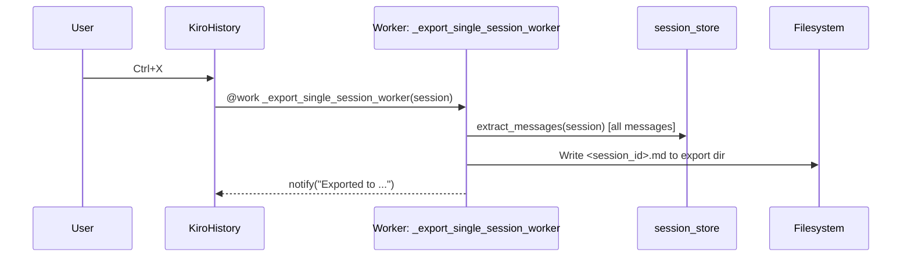
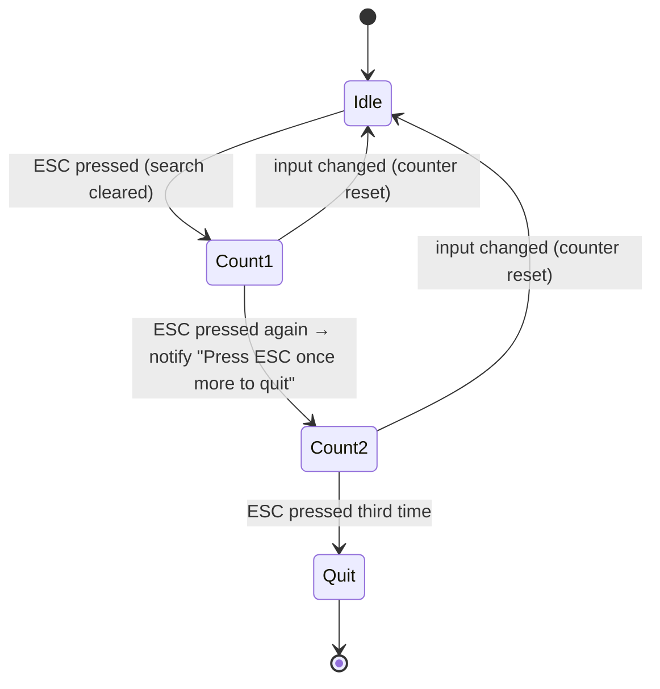

# Workflows

## App Startup

---

## Session List Filtering

Applies when the user types in the path filter or search box.

---

## Preview Load (Lazy)

Triggered when the user highlights a session in the list.

---

## Load More Messages

Triggered by `Ctrl+M` when preview is not fully loaded.

---

## In-Preview Search

Triggered by `Ctrl+F`.

---

## Session Resume

---

## Session Rename (F2)

Only JSONL sessions support rename (SQLite sessions are read-only).

---

## Archive Sync (on startup)

---

## Export Session (`Ctrl+X`)

Exports the selected session as a markdown file.

---

## ESC Behavior (triple-ESC to quit)

The counter auto-resets after a timer expires (to prevent accidental quit from slow presses).
